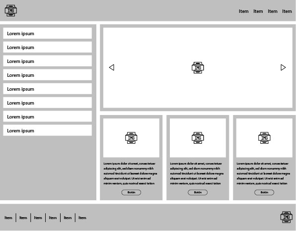

# Prueba Técnica de Maquetación 

## Candidato: Luis Belisario
### Enlace a la página web: [La Razón](https://lebs87.github.io/PruebaTecnicaH/)

### Tarea:

- Se adjunta un prototipo que se deberá representar. 

- Libre elección tanto de tipografía, imágenes y colores.

### Requisitos:

- Nomenclatura de clases a elección.
- Arquitectura de archivos a elección.
- Uso de logo e imágenes donde se indica.
- Incluir una tipografía externa.
- Incluir librería carousell externa.
- Comportamiento responsive (mobile, tablet y desktop).
- Uso de Sass / Less.
- Uso de variables y mixins Sass / Less.

### Desarrollo:

Para la elaboración de este proyecto, al tratarse de una vacante para maquetador de un equipo de noticias, decidí tomar como guía en la parte estética al diario [La Razón](https://www.larazon.es/); por lo cual, usé tipografía, imágenes y colores similares.

Para cumplir con todos los requisitos usé el tipo de diseño web mobile First, ubicando las imágenes donde se indica, incluí tipografía externa, una librería carousell externa, se logró el comportamiento responsive (mobile, tablet y desktop), implementé SASS y establecí variables e implementé varios mixins.

Como elemento extra se añadió una página de error 404.

A continuación detallaré las herramientas empleadas y su uso dentro del proyecto. 

## FrameWork

[Bootstrap](https://getbootstrap.com/): El mismo me permitió crear un proyecto responsive con un menor coste de tiempo y esfuerzo. Lo usé para añadir los menú de navegación, carrusel y tarjetas.

## Librería

[Google Fonts](https://fonts.google.com/knowledge): Esta librería aportó la tipografía del proyecto. (IBM Plex Sans y Public Sans)

## Preprocesador 
[SASS](https://sass-lang.com/): Este preprocesador me permitió terner una mejor Arquitectura, además empleé variables y mixins.

## Otros
- Fonts Ninja: Para definir el tipo de letra.
- ColorZilla: Para tomar muestras de color.
